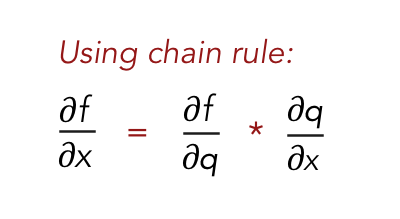

What is a neural network neuron?
A Neural network neuron is a storage unit that stores a number or a “signal"in case of a human brain. The neutrons in our brain also have their own computation unit. A neural network neuron has the computation unit outside it. This computation unit combines with a weight(for each neuron) and stores the result of the computation. Subsequently an activation function acts on it and decides the magnitude/intensity of this neuron that needs to be carried forward to the next layer.
Below equation depicts the calculation.
z (neuron_a) = {Activation function} * ({input from the input connection} * {weight of the neuron}) + bias)

This output of the neuron(neuron_a) in layer 1 serves as an input to the neuron(neuron_b) in layer 2. The two neurons neuron_a and neuron_b are connected by the outgoing connection from neuron_a$

What is the use of the learning rate?
In gradient descent, the learning rate handles magnitude(+ve or -ve) with which a weight needs to change to reduce the loss value of the NN. The gradient itself sets the direction in which the NN weights need to decrease to reduce the loss value, such that a local minima could be achieved.
The learning rate provides a rather smooth convergence of the loss at a steady rate. A larger learning rate might lead to overshooting of the local minima a much lower learning rate may take very long time to converge to the local minima. This needs to be set at the optimum value and ideally for the initial epocs the value could be higher for a faster convergence and as the loss value reduces, for the later epocs, the learning rate can be reduced to avoid overshooting the local minima.

How are weights initialized?
Weights are initialized in a random manner based on normal distribution with zero-mean and a calculated variance. The intuition behind the generalization of a NN is about learning from the input distribution. The weights should follow a normal distribution (or something similar) such that as it learns during the training it is able to converge better. The scale of the initial weight distribution affects the convergence of the network. The smaller the scale, better the convergence.
Higher values of weights (or constant values) could impede the convergence and may result in vanishing/exploding gradients.

What is "loss" in a neural network?
The difference between the NN output (predicted output) and the actual ground truth is the loss value in the neural network. The loss function determines the learning (training) outcome in a NN. A loss function shows the NN the gaps that it needs to fill.

What is the "chain rule" in gradient flow ? 
Chain rule is a way to find the partial derivative of a function A with respect to another function B, by using a function C

Eg:

In case of neural network, chain rule helps in propagating the loss value from one layer to another such that a given NN, the values of the weights can increase/decrease in the right direction wrt the loss value

